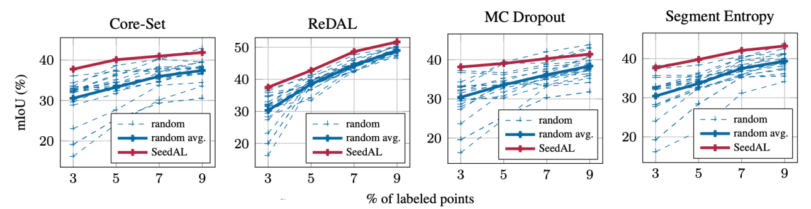
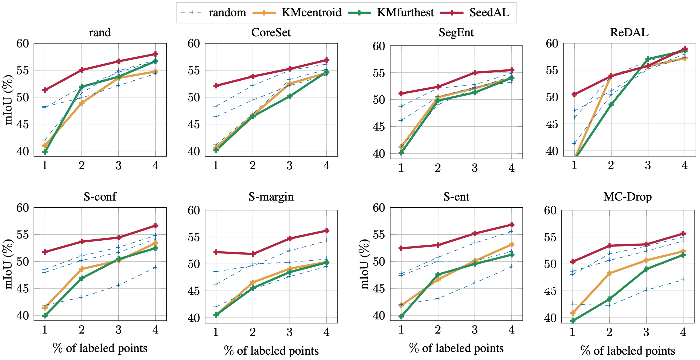
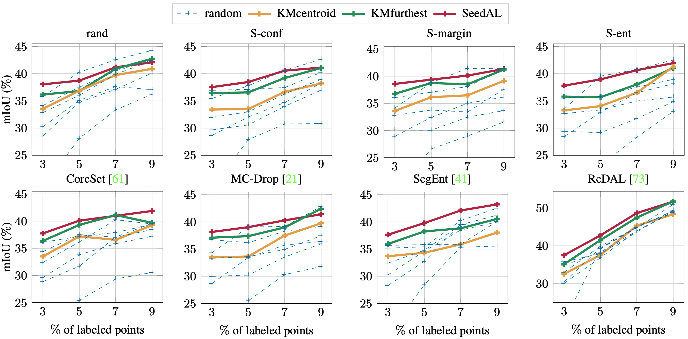

# You Never Get a Second Chance To Make a Good First Impression: Seeding Active Learning for 3D Semantic Segmentation

Official PyTorch implementation of SeedAL.

> [**You Never Get a Second Chance To Make a Good First Impression:
Seeding Active Learning for 3D Semantic Segmentation**](http://arxiv.org/abs/2304.11762),            
> [Nermin Samet](https://nerminsamet.github.io/), [Oriane Siméoni](https://osimeoni.github.io/), [Gilles Puy](https://sites.google.com/site/puygilles/), [Georgy Ponimatkin](https://ponimatkin.github.io/), [Renaud Marlet](http://imagine.enpc.fr/~marletr/), [Vincent Lepetit](https://vincentlepetit.github.io/),
> *ICCV 2023.*

## Summary
Active learning seeds (initial sets) have 
significant effect on the performances of 
active learning methods. Below, we show the variability of results obtained with 20 different random seeds (blue dashed lines), within an initial annotation budget of 3% of the dataset, when using various active learning methods for 3D semantic segmentation of S3DIS.
We compare it to the result obtained with our seed selection strategy (solid red line), SeedAL, which performs
better or on par with the best (lucky) random seeds among 20, and “protects” from very bad (unlucky) random seeds.



We propose SeedAL for automatically constructing a seed that will ensure good performance for AL. 
Assuming that images of the point clouds are available, which is common, our method relies on powerful unsupervised image features 
to measure the diversity of the point clouds. 
It selects the point clouds for the seed by optimizing the diversity under an annotation budget. 

## Outdoor Evaluation Results on Semantic KITTI



## Indoor Evaluation Results on S3DIS



## Installation

Given images of the point cloud scenes, 
SeedAL outputs an initial set (or seed) under a certain budget to start the training 
of active learning methods for 3D point cloud semantic segmentation.
In our experiments we have used [ReDAL](https://github.com/tsunghan-wu/ReDAL) framework which implements several active learning methods.
For S3DIS and Semantic KITTI, SeedAL also follows the [data preparation](https://github.com/tsunghan-wu/ReDAL/tree/main/data_preparation) of ReDAL to be consistent with AL trainings.

### Environmental Setup

The codebase was tested on Ubuntu 20.04 with Cuda 11.1. 
NVIDIA GPUs are needed for extracting the DINO features.

~~~
conda create --name seedal python=3.7
conda activate seedal
conda install pytorch==1.10.2 torchvision==0.11.3 cudatoolkit=11.1 -c pytorch
pip install -r requirements.txt
~~~

After setting up the data and environment, you can run SeedAL as follows:

~~~
python main.py -d <dataset name> 
~~~

By default, we save the results from intermediate steps such dataset statistics, DINO features and calculated scene diversities.

## Acknowledgement

This work was granted access to the HPC resources of IDRIS under the allocation 2023-AD011013267R1 made by GENCI. 


## License

SeedAL is released under the [Apache 2.0 License](LICENSE). 

## Citation

If you find SeedAL useful for your research, please cite our paper as follows.

> Nermin Samet, Oriane Siméoni, Gilles Puy, Georgy Ponimatkin, Renaud Marlet, Vincent Lepetit, "You Never Get a Second Chance To Make a Good First Impression: Seeding Active Learning for 3D Semantic Segmentation",
> arXiv, 2023.


BibTeX entry:
```
@inproceedings{seedal,
  author = {Nermin Samet, Oriane Siméoni, Gilles Puy, Georgy Ponimatkin, Renaud Marlet and Vincent Lepetit},
  title = {You Never Get a Second Chance To Make a Good First Impression: Seeding Active Learning for 3D Semantic Segmentation},
  booktitle = {arXiv},
  year = {2023},
}
```

